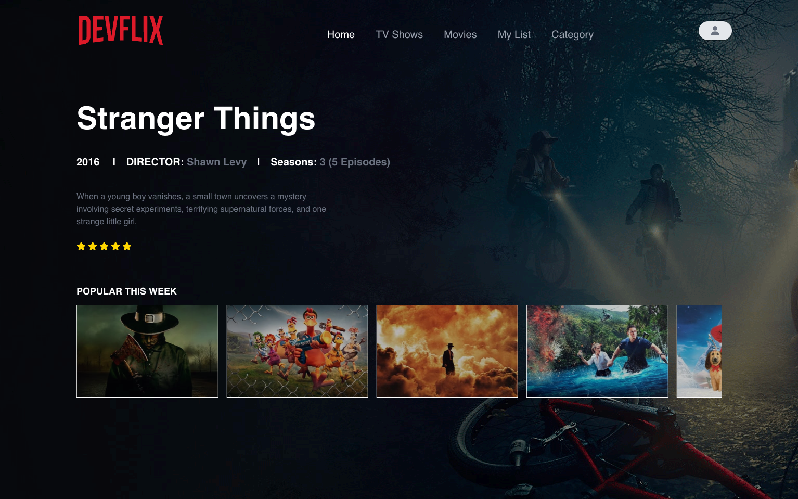

# Devflix

> Clone of Netflix web app



## Installation

OS X & Linux & Windows:

```sh
git clone https://github.com/MaximeBignolet/netflix-clone-app.git

cd Frontend/
npm install
npm run dev

cd Backend
npm install
npm start
```

## Meta

Maxime Bignolet – [@Linkedin](https://www.linkedin.com/in/maxime-bignolet-8228bb219/) - https://www.linkedin.com/in/maxime-bignolet-8228bb219/

Github - https://github.com/MaximeBignolet

## Contributing

1. Fork it
2. Create your feature branch (`git checkout -b feature/fooBar`)
3. Commit your changes (`git commit -m "your commit"'`)
4. Push to the branch (`git push origin main`)
5. Create a new Pull Request
